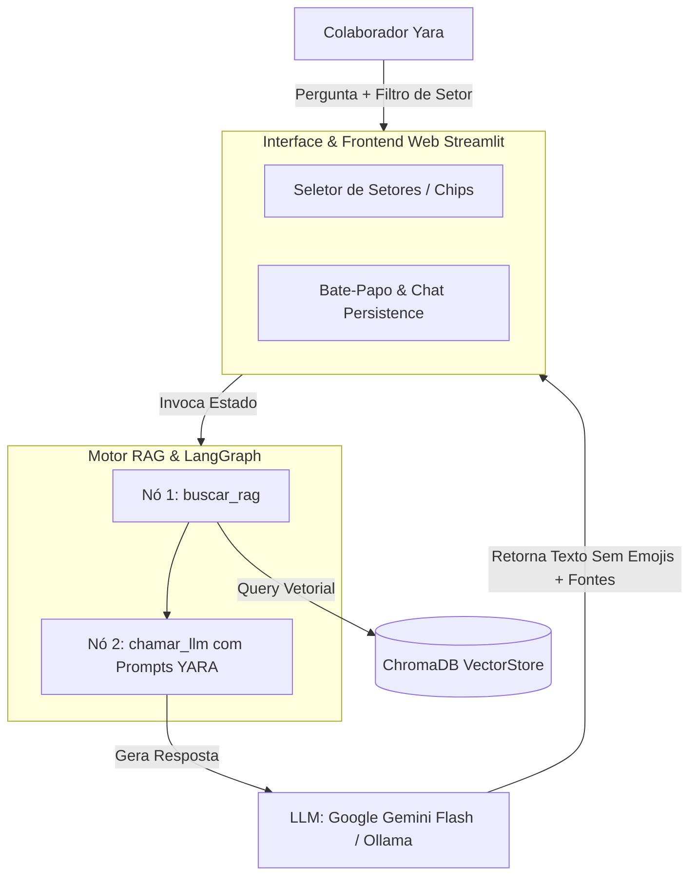

# YARIS Intelligent System: Agente Corporativo de IA & Base de Conhecimento Interna da Yara Ltda.

[](https://www.python.org/)
[](https://streamlit.io/)
[](https://www.langchain.com/)
[](https://langchain-ai.github.io/langgraph/)
[](https://www.trychroma.com/)
[](#visão-geral)
[](https://opensource.org/licenses/MIT)

---

## Desenvolvedora

[](https://www.linkedin.com/in/jhiovanasilva/)
[-%23181717.svg?logo=github&logoColor=white)](https://github.com/jhsribeiro)

---

## Sumário

- [Visão Geral](#visão-geral)
- [Sobre o Desafio](#sobre-o-desafio)
- [Principais Funcionalidades](#principais-funcionalidades)
- [Pacotes Utilizados](#pacotes-utilizados)
- [Estrutura do Projeto](#estrutura-do-projeto)
- [Diagrama de Arquitetura do Sistema](#diagrama-de-arquitetura-do-sistema)
- [Documentação da Base de Conhecimento](#documentação-da-base-de-conhecimento)
- [Configuração do Ambiente](#configuração-do-ambiente)
- [Licença](#licença)

---

## Visão Geral

A **Yara Ltda.** foi criada originalmente no âmbito acadêmico como o **Projeto Integrador do curso Técnico em Administração**, no qual foi desenvolvido um Plano de Negócios completo para uma empresa referência em moda consciente com peças biodegradáveis, loja conceito no **Shopping Iguatemi Brasília** e centro operacional no Distrito Federal.

Como evolução dessa iniciativa no **Desafio Final Alura Agent (Oracle + Alura ONE)**, foi desenvolvido o **YARIS** (*Yara Intelligent System*), um assistente virtual corporativo de Inteligência Artificial para a Yara Ltda. O sistema centraliza, estrutura e responde instantaneamente a dúvidas dos colaboradores sobre processos operacionais (SOPs), manuais de RH, políticas de compliance, LGPD, diretrizes trabalhistas, faturamento e chamados de TI, eliminando o tempo desperdiçado na busca manual de arquivos.

> 🚀 **Aplicação em Produção (Deploy no Oracle Cloud Infrastructure - OCI):**  
> Acesse a aplicação online: [](#visão-geral)  
> *Hospedado na infraestrutura de nuvem de alta performance da **Oracle Cloud (OCI)**.*

**Domínio de Aplicação:** Gestão do Conhecimento Corporativo & Assistência Virtual Inteligente via RAG (Retrieval-Augmented Generation).  
**Público-Alvo:** Colaboradores, Gestores e Liderança da Yara Ltda.

---

## Sobre o Desafio

Este projeto foi desenvolvido como a entrega do **Desafio Final da Trilha de Inteligência Artificial** do programa **Oracle Next Education (ONE)** em parceria com a **Alura**.

### Objetivos do Desafio
- **Aplicação Prática de Agentes de IA**: Criar um agente inteligente corporativo capaz de resolver problemas reais de negócio utilizando técnicas modernas de **RAG (Retrieval-Augmented Generation)**.
- **Orquestração Stateful**: Implementar um fluxo de execução baseado em grafos de estado com **LangGraph**, permitindo tomar decisões condicionais, tratar contextos vazios e formatar respostas com precisão.
- **Armazenamento e Recuperação Vetorial**: Estruturar e indexar documentos corporativos (PDFs e Markdown) em um banco de dados vetorial (**ChromaDB**), garantindo busca semântica relevante e filtragem por metadados.
- **Flexibilidade e Privacidade**: Oferecer suporte tanto a provedores de LLM baseados em nuvem (Google Gemini) quanto a execuções 100% locais e privadas via Ollama.
- **Interface e Experiência do Usuário (UI/UX)**: Construir um painel interativo e intuitivo em **Streamlit** com histórico de bate-papo, seletores de setor e alternância de modelos em tempo de execução.

---

## Principais Funcionalidades

- 🧠 **Motor RAG com LangGraph (Stateful Agent)**:
  - Orquestração de estado inteligente que avalia a presença de documentos relevantes antes de responder.
  - Tratamento gracioso para dúvidas sem correspondência na base de conhecimento, direcionando o colaborador aos canais corretos sem alucinações.

- 🏢 **Busca Vetorial Filtrada por Setor Corporativo**:
  - Indexação inteligente no ChromaDB categorizando automaticamente cada documento por departamento (*Recursos Humanos*, *Financeiro*, *Compliance & LGPD*, *Facilities & Suprimentos*, *TI & Chamados*, *SAC*, *Operações & Logística*, etc.).
  - Permite ao usuário filtrar suas pesquisas por setor específico ou realizar busca ampla em toda a empresa.

- 🔄 **Arquitetura Híbrida e Multiprovedor (Nuvem vs 100% Local)**:
  - **Google Gemini**: Respostas ultra-rápidas via API Gemini (`gemini-2.5-flash`).
  - **Ollama Local**: Execução 100% privada e offline utilizando modelos como `llama3:8b` ou `gemma:2b`.
  - **Embeddings Flexíveis**: Suporte para `gemini-embedding-001` e `snowflake-arctic-embed2:latest`.

- ⚖️ **Compliance & Diretrizes Corporativas Estritas**:
  - Aplicação rigorosa das regras de comunicação da Yara Ltda.
  - Substituição obrigatória do termo "sustentabilidade" por **"responsabilidade ambiental e social"** quando referente às ações da própria Yara.
  - Tom formal, técnico e corporativo, livre de emojis ou informalismos.

- 💻 **Interface Web Obsidian Dark Mode (Streamlit)**:
  - Design premium responsivo em modo escuro.
  - Seleção dinâmica de provedores e modelos no painel lateral.
  - Exibição de metadados, fontes consultadas e histórico de conversação mantido na sessão.

- 🛡️ **Resiliência e Tratamento de Exceções**:
  - Manipulação inteligente de cota de API (Erro 429), com tentativas resilientes e avisos amigáveis para o usuário.
  - Diagnóstico imediato no painel web caso o serviço local do Ollama ou modelo selecionado não esteja em execução.


---

## Pacotes Utilizados

Lista das principais dependências Python utilizadas no projeto.

| Pacote | Versão | Descrição |
| :--- | :--- | :--- |
| **streamlit** | `^1.30.0` | Framework para construção da interface web interativa em modo escuro. |
| **langchain** | `^0.3.0` | Framework principal de orquestração de componentes de Inteligência Artificial. |
| **langgraph** | `^0.2.0` | Motor de fluxo de trabalho baseado em grafos de estado (Stateful RAG Workflow). |
| **langchain-google-genai** | `^2.0.0` | Integração oficial para os modelos LLM do Google Gemini (`gemini-flash-latest`). |
| **langchain-ollama** | `^0.2.0` | Integração para embeddings locais via Ollama (`snowflake-arctic-embed2:latest`). |
| **langchain-chroma** | `^0.1.4` | Conector oficial do banco vetorial ChromaDB com LangChain. |
| **chromadb** | `^0.5.0` | Banco de dados vetorial de alto desempenho para armazenamento e busca por similaridade. |
| **pypdf** | `^4.0.0` | Leitor e extrator de documentos em formato PDF. |
| **tqdm** | `^4.66.0` | Barra de progresso visual para o pipeline de ingestão e loteamento. |
| **python-dotenv** | `^1.0.0` | Gerenciamento e carregamento seguro de variáveis de ambiente (`.env`). |

---

## Estrutura do Projeto

A arquitetura do projeto é modular e separada entre o frontend (Streamlit), o pipeline de ingestão vetorial, a base de conhecimento estruturada (`docs/`) e a lógica RAG (`src/`).

```
alura-agent/
├── assets/
│   ├── fluxo_langgraph.png
│   └── logo_yaris.png
├── docs/
│   ├── 01_processos_operacionais_sops/
│   │   ├── SOP-001_Atendimento_e_Venda_Presencial.md
│   │   ├── SOP-002_Operacao_Caixa_e_Emissao_NF_Omie.md
│   │   ├── SOP-003_Logistica_Reversa_e_Trocas.md
│   │   ├── SOP-004_Gestao_Estoque_e_Contingencia_Atelie_Almada.md
│   │   └── SOP-005_Solicitacao_de_Materiais_de_Escritorio_e_Papelaria.md
│   ├── 02_politicas_e_compliance/
│   │   ├── POL-001_Politica_de_Moda_Sustentavel_e_Fornecedores.md
│   │   ├── POL-002_Gestao_Social_e_Impacto_Comunitario.md
│   │   ├── POL-003_Direitos_Trabalhistas_e_Conduta.md
│   │   ├── POL-004_Politica_de_Compliance_LGPD_e_Anticorrupcao.md
│   │   └── POL-005_Politica_de_Beneficios_e_Banco_de_Horas.md
│   └── 03_guias_e_faqs/
│       ├── GUI-001_Onboarding_Novos_Colaboradores.md
│       ├── GUI-002_Diretorio_Contatos_Ramais_Emails.md
│       ├── FAQ-001_Duvidas_Frequentes_Vendas_e_Produtos.md
│       └── FAQ-002_Duvidas_Operacionais_e_Sistemas.md
├── scripts/
│   ├── pipeline_ingestao.py
│   └── visualizar_grafo.py
├── src/
│   ├── database/
│   │   └── connection.py
│   ├── graph/
│   │   ├── build.py
│   │   ├── edges.py
│   │   ├── nodes.py
│   │   ├── prompts.py
│   │   └── state.py
│   └── config.py
├── .env
├── .gitignore
├── app.py
├── requirements.txt
└── README.md
```

---

## Diagrama de Arquitetura do Sistema



---

## Documentação da Base de Conhecimento

A base de dados é categorizada de maneira padronizada e indexada no banco vetorial ChromaDB com metadados de setor corporativo:

### 1. Processos Operacionais Padronizados (SOPs)
Procedimentos passo a passo da rotina da empresa.

| Código | Documento | Setor Mapeado | Descrição |
| :--- | :--- | :--- | :--- |
| **SOP-001** | `SOP-001_Atendimento_e_Venda_Presencial.md` | Atendimento ao Cliente (SAC) | Atendimento na loja conceito do Shopping Iguatemi Brasília. |
| **SOP-002** | `SOP-002_Operacao_Caixa_e_Emissao_NF_Omie.md` | Financeiro | Abertura/fechamento de caixa e emissão de NFC-e no Omie. |
| **SOP-003** | `SOP-003_Logistica_Reversa_e_Trocas.md` | Operações & Logística | Código de postagem no Melhor Envio e trocas em loja. |
| **SOP-004** | `SOP-004_Gestao_Estoque_e_Contingencia.md` | Operações & Logística | Estoque mínimo e acionamento do parceiro local (Ateliê Almada - DF). |
| **SOP-005** | `SOP-005_Solicitacao_de_Materiais_Escritorio.md` | Facilities & Suprimentos | Requisição de papelaria ecológica no Omie e prazos de 3 a 5 dias. |

---

### 2. Políticas Corporativas e Compliance (POLs)
Regras corporativas, diretrizes trabalhistas e governança.

| Código | Documento | Setor Mapeado | Descrição |
| :--- | :--- | :--- | :--- |
| **POL-001** | `POL-001_Politica_de_Moda_Sustentavel.md` | Comercial & Vendas | Homologação de tecidos biodegradáveis e compras transparentes. |
| **POL-002** | `POL-002_Gestao_Social_e_Impacto.md` | Gestão Social & Impacto | Doação de peças e impacto comunitário no DF (Estrutural/Ceilândia). |
| **POL-003** | `POL-003_Direitos_Trabalhistas_e_Conduta.md` | Recursos Humanos | Código de conduta, jornada CLT e igualdade de oportunidades. |
| **POL-004** | `POL-004_Compliance_LGPD_e_Anticorrupcao.md` | Compliance & LGPD | Privacidade de dados de clientes, canal de denúncias e anticorrupção. |
| **POL-005** | `POL-005_Beneficios_e_Banco_de_Horas.md` | Recursos Humanos | Regras do Banco de Horas, compensação em 6 meses e Plano de Saúde. |

---

### 3. Guias Práticos e Perguntas Frequentes (GUIs / FAQs)
Guias de integração e apoio ao colaborador.

| Código | Documento | Setor Mapeado | Descrição |
| :--- | :--- | :--- | :--- |
| **GUI-001** | `GUI-001_Onboarding_Novos_Colaboradores.md` | Recursos Humanos | Guia de boas-vindas e checklist dos primeiros 7 dias. |
| **GUI-002** | `GUI-002_Diretorio_Contatos_Ramais_Emails.md` | Recursos Humanos | Diretório oficial de ramais, e-mails e contatos por departamento. |
| **FAQ-001** | `FAQ-001_Duvidas_Frequentes_Vendas.md` | Atendimento ao Cliente (SAC) | Respostas para dúvidas comuns sobre lavagem de tecidos e garantia. |
| **FAQ-002** | `FAQ-002_Duvidas_Operacionais_Sistemas.md` | TI & Chamados | Resoluções de problemas no ERP Omie, impressoras e chamados de TI. |

---

## Configuração do Ambiente

Siga os passos abaixo para configurar o ambiente localmente.

### 1. Clonar o Repositório
```bash
git clone https://github.com/jhsribeiro/yaris-agent.git
cd yaris-agent
```

### 2. Criar e Ativar o Ambiente Virtual
```powershell
# Criar ambiente virtual
python -m venv .venv

# Ativar ambiente virtual (Windows PowerShell)
.\.venv\Scripts\Activate.ps1
```

### 3. Instalar as Dependências
```bash
pip install -r requirements.txt
```

### 4. Configurar as Variáveis de Ambiente
Crie um arquivo `.env` na raiz do projeto (ou copie do `.env.example`) com as configurações da API do Gemini e/ou Ollama Local:
```env
# Chave de API do Google AI Studio (necessária se usar o provedor google)
GOOGLE_API_KEY=sua_chave_api_aqui

# Provedor de Embeddings: 'google' ou 'ollama'
EMBEDDING_PROVIDER=google
# Modelo de embeddings do Gemini
EMBEDDING_MODEL=models/gemini-embedding-001
# Modelo de embeddings do Ollama local
OLLAMA_EMBEDDING_MODEL=snowflake-arctic-embed2:latest

# Provedor de LLM: 'google' ou 'ollama'
LLM_PROVIDER=google
# Modelo de LLM do Gemini
LLM_MODEL=gemini-2.5-flash
# Modelo de LLM do Ollama local
OLLAMA_LLM_MODEL=llama3:8b
# URL da instância local do Ollama
OLLAMA_BASE_URL=http://localhost:11434
```

> **Nota para uso do Ollama Local:**  
> Caso escolha utilizar o Ollama, certifique-se de que o serviço do Ollama está rodando localmente na sua máquina e que possui o modelo baixado (ex: `ollama run llama3:8b`).

### 5. Executar o Pipeline de Ingestão de Dados (ChromaDB)
```bash
python scripts/pipeline_ingestao.py
```

### 6. Iniciar a Aplicação Streamlit
```bash
streamlit run app.py
```
Acesse a aplicação no seu navegador no endereço: `http://localhost:8501`. Na barra lateral, você poderá alternar entre **Google Gemini (Nuvem)** e **Ollama (Local)** e escolher os modelos instalados em tempo de execução.


---

## Licença

Este projeto foi desenvolvido como parte integrante do **Desafio Final Alura Agent (Oracle + Alura ONE)** sob a licença MIT.
