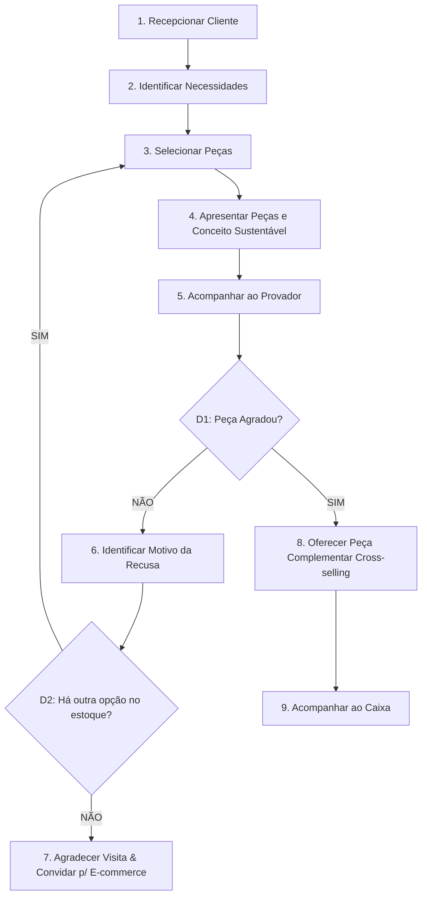

# SOP-001: Atendimento e Venda Presencial

> **Categoria**: Processos Operacionais (SOPs) 
> **Departamento**: Vendas & Salão 
> **Responsável**: Consultor de Vendas 
> **Tempo de Leitura**: 4 minutos 
> **Versão**: 1.0 (Yara Ltda. - Iguatemi Brasília)

---

## Objetivo
Padronizar a jornada de atendimento presencial na loja física da Yara Ltda. (Shopping Iguatemi Brasília), garantindo uma experiência de consumo consciente de alto padrão e alinhada aos pilares socioambientais da marca.

---

## Fluxo Visual do Atendimento

---

## Passo a Passo da Operação

### 1. Recepção e Abordagem
1. Cumprimente o cliente com uma saudação receptiva e acolhedora assim que ele cruzar a entrada da loja.
2. Evite abordagens agressivas de vendas; mantenha o tom de voz sereno e elegante.

### 2. Identificação de Necessidades
1. Faça perguntas abertas para compreender a busca do cliente (ex: *"Procura uma peça para o dia a dia ou uma ocasião especial?"*).
2. Escute ativamente para identificar a preferência por estilo, caimento e tecidos.

### 3. Seleção de Peças
1. Localize no salão de vendas ou estoque as opções adequadas ao perfil do cliente.
2. Dê destaque sempre à **Camiseta NATIV** (peça carro-chefe da Yara em algodão orgânico).

### 4. Apresentação e Storytelling
1. Apresente as roupas ressaltando a qualidade do corte, o toque do tecido e o caimento.
2. Explique a origem sustentável: tingimento natural, produção desacelerada (*slow fashion*) e pegada ecológica reduzida.

### 5. Provador e Avaliação (Decisão D1)
1. Conduza o cliente à cabine de prova e permaneça à disposição do lado de fora.
2. Se a peça agradar (**SIM**), avance para a **Etapa 8**.
3. Se o cliente recusar (**NÃO**), pergunte sutilmente o motivo (tamanho, cor ou caimento).
 - Se houver opção substituta (**D2 = SIM**), traga a nova peça do estoque.
 - Se não houver opção (**D2 = NÃO**), agradeça a visita e apresente o QR Code do nosso e-commerce para futuras compras.

### 6. Venda Complementar (Cross-selling)
1. Para compras confirmadas, sugira uma segunda peça complementar que combine com o look escolhido (ex: ecobag ou acessório sustentável).

### 7. Encaminhamento ao Caixa
1. Acompanhe o cliente até o balcão de atendimento e faça o transbordo para o Operador de Caixa com elegância.

---

## Resultado Esperado
Cliente atendido de forma personalizada e consultiva, compreendendo o valor da moda sustentável Yara, com aumento do ticket médio através de cross-selling ético e transição fluida para o checkout.
