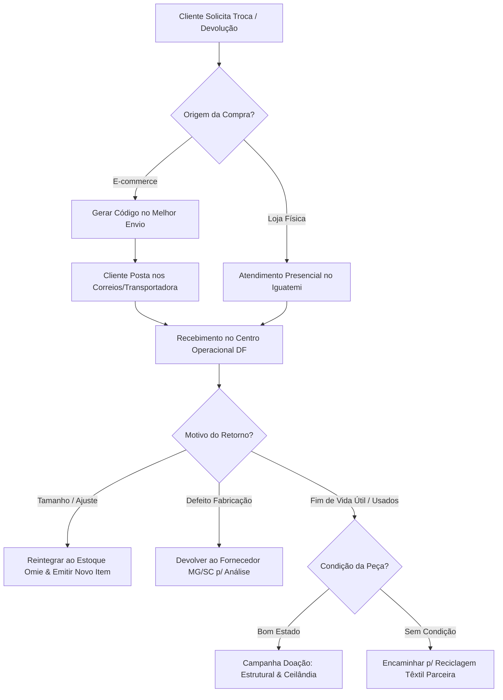

# SOP-003: Logística Reversa, Trocas e Descarte Consciente

> **Categoria**: Processos Operacionais (SOPs) 
> **Departamento**: Logística & Pós-Venda 
> **Responsável**: Assistente Operacional / Atendimento 
> **Tempo de Leitura**: 4 minutos 
> **Versão**: 1.0 (Yara Ltda. - Operações DF e E-commerce)

---

## Objetivo
Padronizar as solicitações de trocas e devoluções do e-commerce e da loja física, além de orientar a logística reversa social para reciclagem e doação de roupas usadas no DF.

---

## Fluxograma do Processo de Troca e Logística Reversa

---

## Passo a Passo da Operação

### 1. Trocas do E-commerce (Nacional)
1. Receba a solicitação de troca do cliente via e-mail ou WhatsApp oficial de atendimento até 30 dias após o recebimento.
2. Acesse o ERP Omie integrado ao **Melhor Envio**.
3. Gerencie a emissão do **código de postagem reversa** e envie por mensagem/e-mail ao cliente (sem nenhum custo adicional para o consumidor).
4. Ao receber o pacote postado no Centro Operacional (Brasília), faça a conferência visual da etiqueta e das condições da roupa.

### 2. Trocas na Loja Física (Iguatemi Brasília)
1. Receba o cliente no balcão de caixa com a peça e a Nota Fiscal / NFC-e.
2. Verifique se a peça não apresenta sinais de lavagem ou uso inadequado (exceto casos de vício de fabricação).
3. Efetue a troca imediata por outro tamanho/modelo disponível no salão ou gere um vale-compras no sistema Omie.

### 3. Tratamento de Peças com Defeito de Fabricação
1. Identificado o defeito de costura ou tecido, registre a ocorrência no módulo de suprimentos do Omie.
2. Separe o item em lote específico para devolução ao fabricante de origem (*fornecedor de slow fashion em Belo Horizonte/MG* ou *Ecológica Têxtil em Tubarão/SC*).
3. Solicite o ressarcimento ou abatimento em duplicatas futuras.

### 4. Programa Social de Doação e Descarte Consciente
1. Acolha clientes que trouxerem roupas antigas da marca Yara na loja física.
2. **Peças em Bom Estado**: Faça a higienização e armazene no lote reservado para as **campanhas de doação comunitária nas regiões da Estrutural e Ceilândia (DF)**.
3. **Peças Degradadas / Sem Condições de Uso**: Encaminhe para a reciclagem têxtil e compostagem biodegradável parceira.

---

## Resultado Esperado
Trocas e devoluções processadas com máxima eficiência e custo zero ao consumidor no e-commerce, devoluções a fornecedores devidamente registradas e impacto social positivo nas comunidades vulneráveis do DF através da doação de peças usadas.
