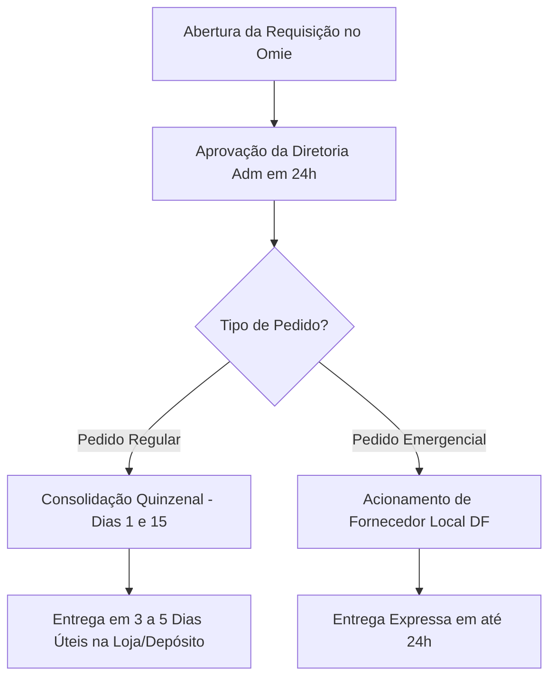

# SOP-005: Solicitação de Materiais de Escritório, Papelaria Ecológica e Facilities

> **Categoria**: Processos Operacionais (SOPs)  
> **Departamento**: Facilities, Suprimentos & Almoxarifado  
> **Responsável**: Assistente Operacional / Facilities  
> **Tempo de Leitura**: 4 minutos  
> **Versão**: 1.0 (Yara Ltda. - Brasília/DF)

---

## Objetivo
Padronizar o procedimento de requisição de materiais de escritório, itens de papelaria ecológica e insumos operacionais de Facilities para a loja física no **Shopping Iguatemi Brasília** e para o **Centro Operacional DF**.

---

## Catálogo de Materiais Ecológicos Homologados

| Categoria | Itens Disponíveis | Requisito de Responsabilidade Social |
| :--- | :--- | :--- |
| **Papelaria Ecológica** | Papel A4 reciclado, blocos de rascunho de fibra vegetal, canetas biodegradáveis | Proibição de itens plásticos descartáveis não recicláveis |
| **Insumos de Loja (Iguatemi)** | Bobinas térmicas sem bisfenol para impressora NFC-e, etiquetas ecológicas, fita adesiva de papel | Abastecimento contínuo para a frente de caixa |
| **Materiais de Limpeza & Higiene** | Detergentes biodegradáveis, panos reutilizáveis, papel toalha 100% reciclado | Fornecedores locais do Distrito Federal |

---

## Passo a Passo da Solicitação

### 1. Abertura do Pedido no ERP Omie
1. Acesse o módulo **Suprimentos / Facilities** no ERP Omie.
2. Selecione a opção **"Nova Requisição Interna de Materiais"**.
3. Selecione a unidade de destino (**Loja Iguatemi** ou **Centro Operacional DF**).
4. Informe os códigos SKU dos itens de papelaria ecológica ou insumos desejados e a quantidade exata.

### 2. Aprovação Administrativa
1. O pedido é enviado automaticamente para validação da Diretoria Administrativa.
2. Pedidos regulares até R$ 500,00 são aprovados em até **24 horas úteis**.

### 3. Prazos de Entrega e Calendário de Pedidos

- **Pedidos Regulares (Calendário Quinzenal)**: Consolidados nos dias **1º e 15 de cada mês**.
- **Prazo de Entrega Padrão**: **3 a 5 dias úteis** após a aprovação da requisição.
- **Pedidos de Urgência / Emergência**: Em caso de término iminente de bobinas fiscais ou insumos críticos, o pedido emergencial é entregue em até **24 horas** via fornecedor local do DF.

---

## Suporte e Dúvidas de Facilities
- **Departamento**: Facilities & Suprimentos
- **Ramal Interno**: 301
- **E-mail para Solicitações**: `logistica@yarastore.com.br` / `adm@yarastore.com.br`

---

## Resultado Esperado
Garantia de abastecimento contínuo de materiais de escritório e papelaria com 100% de responsabilidade ambiental e social, cumprimento rigoroso do prazo de 3 a 5 dias úteis e custo sob controle no ERP Omie.
