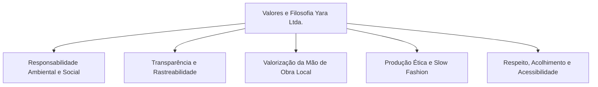

# POL-000: Identidade Corporativa — Missão, Visão e Valores

> **Categoria**: Políticas e Compliance 
> **Departamento**: Diretoria Executiva, Marketing & RH 
> **Aprovação**: Diretoria Colegiada Yara Ltda. (Direção Administrativa, Marketing e Produção) 
> **Tempo de Leitura**: 4 minutos 
> **Versão**: 1.0 (Yara Ltda. — Plano de Negócios)

---

## 1. Origem e Conceito da Marca

A **Yara Ltda.** é uma empresa brasileira de moda de alto padrão no segmento *streetwear*, sediada no **Shopping Iguatemi Lago Norte, Brasília (DF)** e com Centro Operacional no Distrito Federal.

O nome **Yara** possui origem tupi-guarani (derivado de *Iara*), refletindo os conceitos de **fluidez, transparência e renovação**. A escolha conecta a marca às raízes brasileiras e ao respeito à natureza, servindo como vetor de diferenciação no mercado de moda consciente.

---

## 2. Missão

Democratizar a moda de alto padrão através de vestuário *streetwear* e peças biodegradáveis produzidas com transparência, materiais orgânicos de baixo impacto e processos éticos, entregando experiências que conectam estilo, conforto, responsabilidade ambiental e social e cuidado com o planeta.

---

## 3. Visão

Ser reconhecida como a principal referência em moda consciente e biodegradável no Distrito Federal e, posteriormente, em todo o Brasil, consolidando um modelo de negócio circular e atemporal que impacte positivamente o meio ambiente e a sociedade.

---

## 4. Filosofia e Valores Fundamentais

1. **Responsabilidade Ambiental e Social**:
   Compromisso de integrar moda e cuidado com o planeta por meio do uso de materiais biodegradáveis, fios orgânicos, tingimento natural e embalagens em tecido reaproveitável (100% isentas de plástico).

2. **Transparência Produtiva e Rastreabilidade**:
   Rastreabilidade total da cadeia de valor e fornecedores homologados (como *Florent* em MG e *Ecológica Têxtil*), garantindo a comprovação das boas práticas socioambientais em todas as peças.

3. **Valorização da Mão de Obra e Economia Local**:
   Parceria estratégica com o *Ateliê Almada (DF)* e fornecedores locais, valorizando o trabalho artesanal regional, reduzindo emissões no transporte e gerando impacto socioambiental positivo na comunidade do DF.

4. **Produção Ética e Slow Fashion**:
   Incentivo ao consumo consciente com peças atemporais de durabilidade superior e design *streetwear* limpo/sofisticado, recusando a obsolescência programada e as liquidações agressivas do *fast fashion*.

5. **Acolhimento, Respeito e Inclusão**:
   Comunicação transparente e acolhedora com os clientes e valorização da equipe de colaboradores (pautada na CLT, igualdade de oportunidades, gestão participativa e incentivo à cidadania).

---

## 5. Diretriz Estratégica de Comunicação

Conforme estabelecido no Plano de Negócios e nas regras de governança da Yara Ltda., ao referir-se às ações, metas e filosofia da própria empresa, utiliza-se a denominação **"responsabilidade ambiental e social"** (ou "responsabilidade socioambiental"). O termo "sustentabilidade" é reservado exclusivamente para análises de mercado ou menções a concorrentes.
