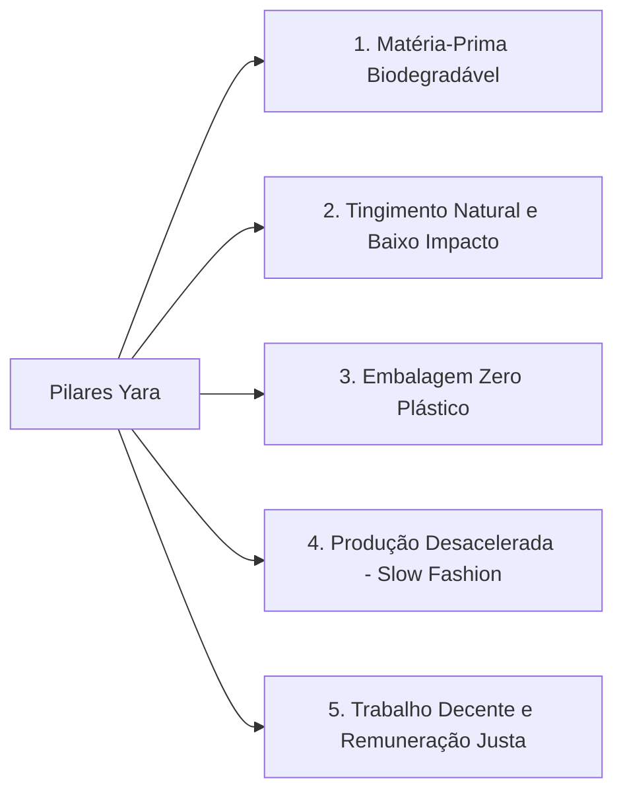

# POL-001: Política de Moda Sustentável e Critérios de Fornecedores

> **Categoria**: Políticas e Compliance 
> **Departamento**: Diretoria Operacional & Produção 
> **Aprovação**: Diretoria de Produção & Gestão Administrativa 
> **Tempo de Leitura**: 4 minutos 
> **Versão**: 1.0 (Yara Ltda.)

---

## Objetivo
Definir as diretrizes inegociáveis de sustentabilidade, ética produtiva e homologação de parceiros da **Yara Ltda. — Moda Sustentável**, orientando a produção de peças biodegradáveis e o alinhamento de fornecedores aos princípios do consumo consciente.

---

## Pilares Fundamentais de Sustentabilidade

1. **Matéria-Prima Biodegradável**: Utilização exclusiva de fios orgânicos (algodão certificado, linho natural e fibras renováveis) com fácil decomposição ao final do ciclo de vida.
2. **Processos de Baixo Impacto**: Proibição de insumos químicos poluentes; adoção de pigmentos ecológicos e tingimento natural.
3. **Embalagem Sustentável**: Eliminação completa de sacolas plásticas e plástico bolha. Uso de ecobags de algodão cru (*Ecológica Têxtil*).
4. **Rejeição ao Fast Fashion**: Não praticamos liquidações agressivas nem obsolescência programada. Fabricamos roupas atemporais de alta durabilidade (com a *Camiseta NATIV* como símbolo).

---

## Benchmarking e Posicionamento de Mercado

| Marca / Player | Posicionamento | Faixa de Preço | Diferencial Estratégico da Yara |
| :--- | :--- | :--- | :--- |
| **Osklen** | Luxo pioneiro em sustentabilidade | R$ 500 a R$ 2.000 | Alto padrão sustentável, mas com maior acessibilidade e atendimento humanizado |
| **Kace Wear** | Streetwear funcional | R$ 200 a R$ 600 | Foco no DF, transparência socioambiental e peças 100% biodegradáveis |
| **Dropsuten** | E-commerce multimarcas local | A partir de R$ 120 | Presença física imersiva (Shopping Iguatemi Brasília) e curadoria própria |
| **C&A (Linhas Eco)** | Varejo de massa global | A partir de R$ 49,90 | Exclusividade de alto padrão, recusa ao consumo descartável e rastreabilidade total |

---

## Diretrizes para Homologação e Auditoria de Fornecedores

Para integrar a cadeia de suprimentos da Yara (seja em MG, SC ou no DF), o fornecedor deve obrigatoriamente:
1. Comprovar ausência total de trabalho análogo à escravidão ou infantil.
2. Apresentar laudos técnicos de vestuário limpo e gestão de resíduos efluentes.
3. Permitir inspeções e auditorias presenciais anuais conduzidas pela equipe de produção da Yara.

---

## Resultado Esperado
Garantia de que 100% das peças vendidas na Yara refletem o compromisso ético e sustentável assumido com a comunidade e clientes, fortalecendo a reputação da marca no segmento de consumo consciente.
