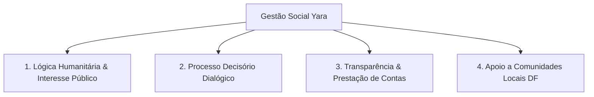

# POL-002: Gestão Social, Transparência e Impacto Comunitário

> **Categoria**: Políticas e Compliance 
> **Departamento**: Gestão Social & Comunicação 
> **Aprovação**: Diretoria Executiva 
> **Tempo de Leitura**: 4 minutos 
> **Versão**: 1.0 (Yara Ltda. - Brasília/DF)

---

## Objetivo
Regulamentar as práticas de responsabilidade social, governança transparente e os programas comunitários promovidos pela Yara Ltda. no Distrito Federal.

---

## Princípios de Gestão Social e Governança

---

## Programas Sociais e Ações Prioritárias

### 1. Programa de Doação Comunitária (Estrutural & Ceilândia)
1. **Coleta na Loja Física**: Manutenção de um ponto de arrecadação permanente na loja do *Shopping Iguatemi Brasília* para descarte consciente de roupas.
2. **Triagem e Recondicionamento**: Seleção de peças em perfeitas condições para doação direta a famílias cadastradas em projetos sociais nas regiões da **Estrutural** e **Ceilândia**.
3. **Periodicidade**: As entregas públicas ocorrem em campanhas anuais com relatórios fotográficos e recibos de doação corporativa.

### 2. Parceria e Valorização do Trabalho Local
1. Dar preferência contínua à contratação de fornecedores e prestadores de serviços locais do DF (como o *Ateliê Almada*), gerando renda e fortalecendo a economia regional descentralizada.

### 3. Transparência e Prestação de Contas Pública
1. **Publicação Anual**: Divulgação do **Relatório de Impacto Socioambiental Yara**, apresentando o volume de peças recicladas, quantidade de roupas doadas e pegada de carbono economizada.
2. **Canais Abertos**: Manutenção de ouvidoria e canal aberto no site/e-mail para feedback da comunidade, fornecedores e clientes sobre o impacto socioambiental das operações.

---

## Modelo Decisório Dialógico
Todas as parcerias institucionais e projetos sociais são deliberados em fóruns abertos entre os diretores e a equipe operacional, priorizando o benefício coletivo sobre o lucro estritamente financeiro.

---

## Resultado Esperado
Consolidação do papel da Yara Ltda. como agente ativo de transformação social no Distrito Federal, gerando transparência, engajamento comunitário e apoio tangível às populações vulneráveis.
