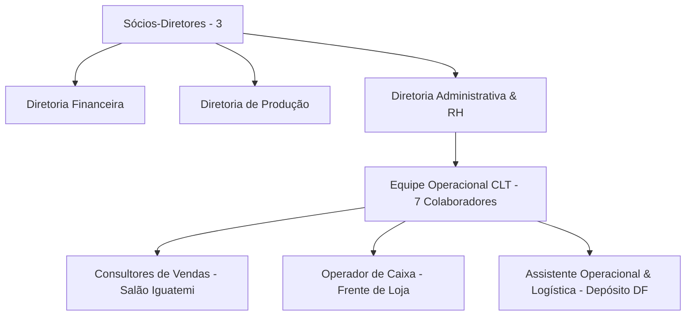

# POL-003: Direitos Trabalhistas, Quadro Operacional e Código de Conduta

> **Categoria**: Políticas e Compliance 
> **Departamento**: Recursos Humanos & Gestão Administrativa 
> **Aprovação**: Diretoria Administrativa & RH 
> **Tempo de Leitura**: 4 minutos 
> **Versão**: 1.0 (Yara Ltda.)

---

## Objetivo
Estabelecer as diretrizes de relações de trabalho, compliance trabalhista (CLT) e o código de conduta ética para todos os colaboradores da Yara Ltda.

---

## Estrutura do Quadro de Pessoal

---

## Compromissos Trabalhistas (CLT)

1. **Vínculo Formal de Trabalho**: 100% dos 7 colaboradores operacionais possuem registro formal em carteira (CLT), garantindo todos os direitos previdenciários e trabalhistas (FGTS, 13º salário, férias remuneradas e descanso semanal).
2. **Jornada Saudável**: Cumprimento rigoroso da jornada de trabalho contratual, sem sobrecarga ou horas extras não compensadas.
3. **Remuneração Justa e Sem Pressão Abusiva**: Fixação de salário compatível com o mercado de varejo premium, suplementado por metas de equipe éticas (evitando a competição predatória entre consultores).

---

## Código de Conduta e Ambiente de Trabalho

### 1. Respeito e Diversidade
É estritamente proibida qualquer conduta discriminatória baseada em raça, gênero, orientação sexual, religião ou origem socioeconômica.

### 2. Atendimento Humanizado ao Cliente
A abordagem ao cliente deve refletir escuta empática e honestidade intelectual sobre os produtos biodegradáveis, sem forçar vendas inadequadas.

### 3. Canal Interno de Ouvidoria e Solução de Conflitos
Qualquer colaborador que presenciar descumprimento de normas, assédio ou insegurança operacional pode acionar diretamente a Diretoria Administrativa (`rh@yarastore.com.br`) ou registrar no canal interno confidencial.

---

## Resultado Esperado
Ambiente corporativo seguro, motivador e transparente, com índice zero de passivos trabalhistas e retenção de talentos alinhados com o propósito de consumo consciente da Yara Ltda.
