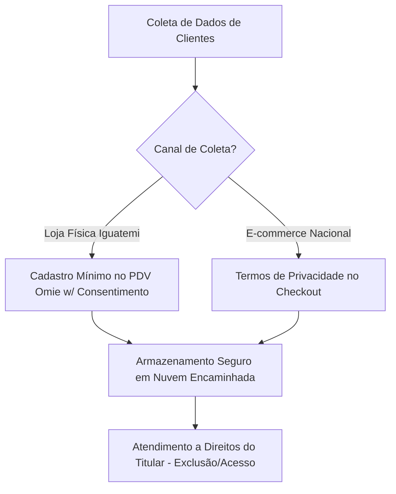

# POL-004: Política de Compliance, LGPD e Anticorrupção

> **Categoria**: Políticas e Compliance 
> **Departamento**: Jurídico, Compliance & Governança 
> **Aprovação**: Diretoria Administrativa & Compliance 
> **Tempo de Leitura**: 4 minutos 
> **Versão**: 1.0 (Yara Ltda. - Brasília/DF)

---

## Objetivo
Regulamentar as normas de conduta ética, integridade corporativa, prevenção à corrupção e proteção de dados pessoais (LGPD) em todas as operações da **Yara Ltda.** (Loja do Shopping Iguatemi Brasília, e-commerce e Centro Operacional DF).

---

## 1. Proteção de Dados Pessoais (LGPD - Lei nº 13.709/2018)

1. **Princípio da Necessidade**: Coletamos apenas os dados pessoais estritamente necessários para a emissão de Notas Fiscais (NFC-e/NF-e), entrega de pedidos via *Melhor Envio* e atendimento de pós-venda.
2. **Consentimento e Transparência**: O cliente deve ser informado sobre a finalidade de uso do CPF, e-mail e telefone no momento do cadastro no PDV ou site.
3. **Direitos dos Titulares**: Qualquer cliente pode solicitar o acesso, correção ou exclusão definitiva de seus dados enviando e-mail para `compliance@yarastore.com.br` ou `rh@yarastore.com.br`.
4. **Segurança da Informação**: É proibido o compartilhamento não autorizado de listas de clientes ou senhas do sistema ERP Omie.

---

## 2. Diretrizes Anticorrupção e Integridade Corporativa (Lei nº 12.846/2013)

1. **Tolerância Zero à Corrupção**: É estritamente proibido oferecer, prometer, pagar ou autorizar qualquer tipo de propina, vantagem indevida ou pagamento de facilitação a agentes públicos ou terceiros em nome da Yara Ltda.
2. **Política de Brindes e Presentes**:
 - É vedado aos colaboradores aceitar ou oferecer presentes corporativos com valor estimado superior a **R$ 100,00**.
 - Qualquer oferta de brinde de fornecedores (como *Ateliê Almada* ou *Ecológica Têxtil*) deve ser reportada à Diretoria Administrativa.
3. **Conflito de Interesses**: Colaboradores devem declarar qualquer relação pessoal ou familiar que possa influenciar decisões de contratação de fornecedores ou vendas.

---

## 3. Canal de Denúncias e Ouvidoria Ética

1. **Canal Confidencial**: Casos de descumprimento do Código de Conduta, vazamento de dados ou suspeita de irregularidades devem ser relatados no canal seguro de Ouvidoria: `ouvidoria@yarastore.com.br` ou via formulário anônimo.
2. **Garantia de Não Retaliação**: A Yara garante o sigilo absoluto e a proteção integral ao denunciante de boa-fé.

---

## 4. Sanções e Penalidades

O descumprimento das diretrizes desta Política acarretará penalidades disciplinares (advertência, suspensão ou demissão por justa causa), sem prejuízo das sanções civis e criminais cabíveis.

---

## Resultado Esperado
Garantia de conformidade legal com a LGPD e Lei Anticorrupção, proteção absoluta da privacidade dos nossos clientes e manutenção do mais alto padrão de ética e **responsabilidade ambiental e social** da marca Yara Ltda.
