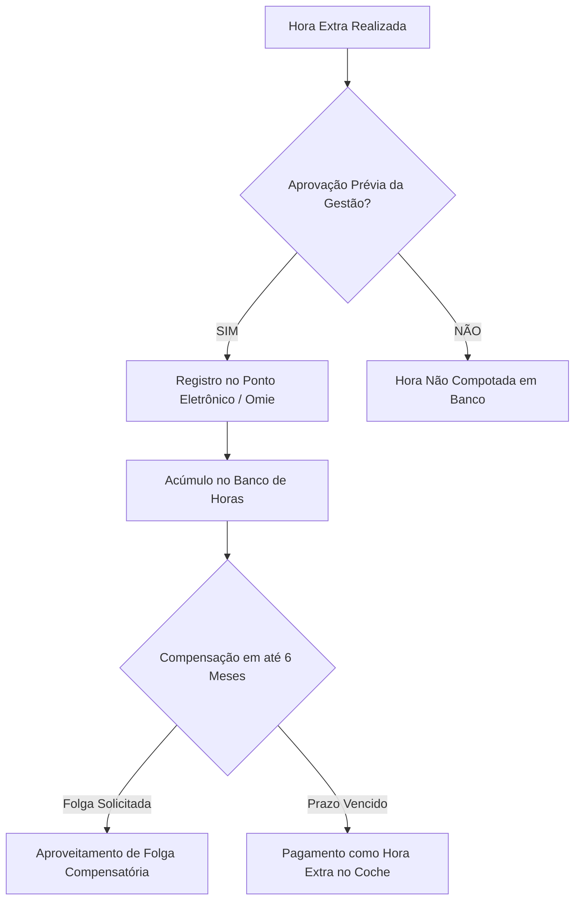

# POL-005: Política de Benefícios do Trabalhador e Banco de Horas

> **Categoria**: Políticas e Compliance 
> **Departamento**: Recursos Humanos & Gestão Administrativa 
> **Aprovação**: Diretoria Administrativa & RH 
> **Tempo de Leitura**: 4 minutos 
> **Versão**: 1.0 (Yara Ltda. - Brasília/DF)

---

## Objetivo
Regulamentar a concessão de benefícios corporativos (Plano de Saúde, VR/VA, VT, Seguro de Vida) e o funcionamento do **Banco de Horas** para os 7 colaboradores operacionais CLT da **Yara Ltda.**

---

## ⏳ 1. Regulamento do Banco de Horas

1. **Jornada de Trabalho**: A jornada contratual padrão é de **44 horas semanais** para os colaboradores operacionais do salão de vendas (Shopping Iguatemi Brasília) e do Centro Operacional/Depósito.
2. **Realização de Horas Extras**:
 - Limitada a no máximo **2 horas extras por dia**, mediante necessidade prévia aprovada pela gestão de RH.
3. **Regra de Compensação**:
 - As horas excedentes acumuladas no Banco de Horas devem ser compensadas em folga ou redução de jornada em um prazo máximo de **6 meses**.
 - **Solicitação de Folga**: O colaborador deve solicitar a folga compensatória com antecedência mínima de 48 horas ao RH (`rh@yarastore.com.br`).
 - **Horas Não Compensadas**: Horas não gozadas no prazo de 6 meses serão pagas na folga de pagamento subsequente com o adicional de 50% conforme CLT.

---

## 2. Pacote de Benefícios Corporativos da Yara

| Benefício | Descrição e Cobertura | Regra de Concessão / Carência |
| :--- | :--- | :--- |
| **Plano de Saúde & Odontológico** | Cobertura médica e odontológica nacional/DF (enfermaria/apartamento) | Concedido após o período de experiência de 90 dias com co-participação reduzida |
| **Vale Refeição / Alimentação (VR/VA)** | Cartão benefício aceito em supermercados e restaurantes no DF | Creditado mensalmente no dia 1º (sem desconto em folha) |
| **Vale Transporte / Mobilidade** | Cobertura do deslocamento até a loja física no Iguatemi ou Depósito | Desconto legal de 6% CLT ou opção de Auxílio Mobilidade Sustentável (para ciclistas/transporte ecológico) |
| **Seguro de Vida em Grupo** | Cobertura em caso de acidentes, invalidez ou falecimento | 100% custeado pela Yara Ltda. a partir do 1º dia de trabalho |
| **Desconto de Colaborador** | **30% de desconto** na compra de vestuário da Yara para uso pessoal | Válido para a linha biodegradável e *Camiseta NATIV* |
| **Auxílio Capacitação & Cursos** | Subvenção de cursos sobre consumo consciente e atendimento | Mediante aprovação da Diretoria Administrativa |

---

## 3. Atendimento e Solicitações de RH

Para tirar dúvidas sobre o extrato do seu Banco de Horas, inclusão de dependentes no Plano de Saúde ou entrega de atestados médicos:
- **Responsável**: Diretoria Administrativa & RH
- **Ramal Interno**: 103
- **E-mail de Contato**: `rh@yarastore.com.br` / `adm@yarastore.com.br`
- **Prazo de Atendimento**: Até 24 horas úteis.

---

## Resultado Esperado
Garantia de saúde, segurança e motivação para a equipe de colaboradores, transparência na apuração das horas de trabalho e cumprimento rigoroso da legislação trabalhista brasileira (CLT).
