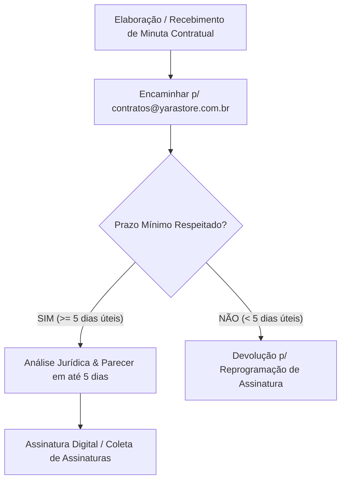

# POL-006: Manual Jurídico, Contratos, NDAs e Compliance Interno

> **Categoria**: Políticas e Compliance 
> **Departamento**: Jurídico, Compliance & Governança 
> **Aprovação**: Diretoria Administrativa, Jurídico & Compliance 
> **Tempo de Leitura**: 4 minutos 
> **Versão**: 1.0 (Yara Ltda. - Brasília/DF)

---

## Objetivo
Regulamentar os procedimentos para solicitação de pareceres jurídicos, análise contratual, celebração de acordos de confidencialidade (NDA), conformidade com a LGPD e termos de cessão de uso de imagem na **Yara Ltda.**

---

## 1. Diretório e Contatos do Setor Jurídico & Compliance

| Atribuição | Responsável / Canal | Contato |
| :--- | :--- | :--- |
| **Central Jurídica & Pareceres** | Setor Jurídico | `juridico@yarastore.com.br` \| **Ramal Interno 109** \| Tel: (61) 3344-1009 |
| **Proteção de Dados & LGPD (DPO)** | Encarregado de Dados (DPO) | `dpo@yarastore.com.br` \| `compliance@yarastore.com.br` |
| **Análise de Contratos e Parcerias** | Gestão de Contratos | `contratos@yarastore.com.br` |

---

## 2. Fluxo para Solicitação e Análise de Contratos

1. **Prazo Mínimo para Análise Jurídica**: Todo contrato (com fornecedores de tecidos, ateliês parceiros, contratos de locação no Shopping Iguatemi, serviços de marketing ou TI) deve ser enviado para `contratos@yarastore.com.br` com no mínimo **5 dias úteis de antecedência** da data pretendida para assinatura.
2. **Minutas Padrão Homologadas**: A Yara disponibiliza minutas padrão pré-aprovadas no portal interno para:
   - Contrato de Prestação de Serviços de Terceiros.
   - Contrato de Fornecimento de Tecidos Biodegradáveis e Confecção de Peças.
   - Termo de Parceria Corporativa e Influenciadores.

---

## 3. Acordos de Confidencialidade (NDA - Non-Disclosure Agreement)

1. **Obrigatoriedade de Assinatura**: É **estritamente obrigatória** a assinatura de NDA (Termo de Confidencialidade) bilateral antes de:
   - Iniciar negociações comerciais estratégicas.
   - Compartilhar fichas técnicas de roupas, corantes ecológicos ou segredos de negócios.
   - Fornecer acesso a dados de clientes, integrações do ERP Omie ou dados financeiros a potenciais parceiros, investidores ou fornecedores terceirizados.
2. **Procedimento**: A minuta de NDA homologada deve ser solicitada via e-mail `contratos@yarastore.com.br` e colhida a assinatura digital das partes antes da troca de qualquer informação confidencial.

---

## 4. Conformidade com a LGPD e Uso de Imagem

1. **Dados Pessoais de Colaboradores e Clientes**: É terminantemente proibido compartilhar listas de e-mails, telefones ou dados de cadastro de clientes fora dos sistemas oficiais autorizados (ERP Omie / CRM).
2. **Termo de Cessão de Uso de Imagem e Voz**: Todo colaborador, modelo ou parceiro que participar de fotos, gravações ou campanhas publicitárias para as redes sociais ou e-commerce da Yara deve assinar o **Termo de Cessão de Uso de Imagem e Voz** disponibilizado pelo setor Jurídico.

---

## Resultado Esperado
Garantia de segurança jurídica integral em todas as parcerias corporativas da Yara Ltda., cumprimento rigoroso do prazo de 5 dias úteis para análise contratual e proteção absoluta da propriedade intelectual e segredos de negócios via NDA.
