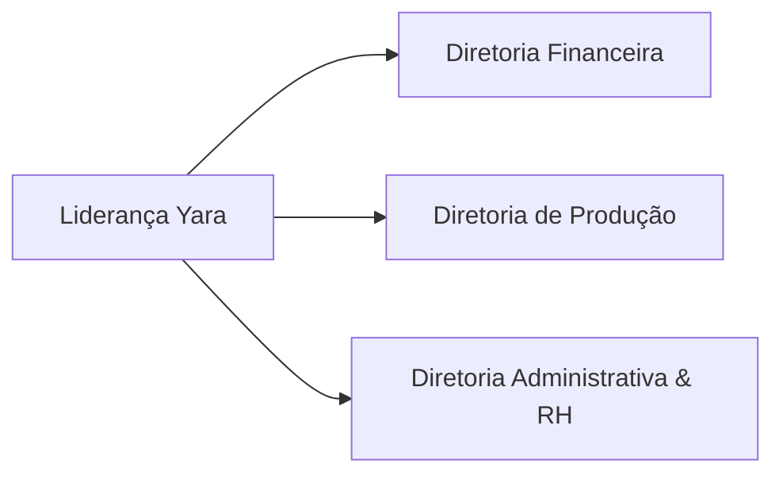
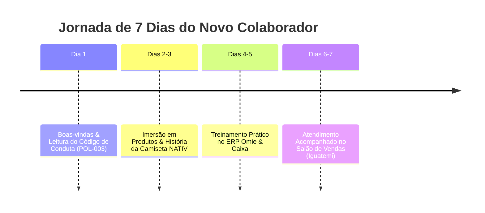

# GUI-001: Guia de Onboarding para Novos Colaboradores

> **Categoria**: Guias e FAQs 
> **Departamento**: Recursos Humanos & Treinamento 
> **Destinatários**: Novos Colaboradores da Yara Ltda. 
> **Tempo de Leitura**: 5 minutos 
> **Versão**: 1.0 (Yara Ltda.)

---

## Bem-vindo(a) à Yara Ltda. — Moda Sustentável!

Ficamos muito felizes em ter você em nosso time! A **Yara Ltda.** nasceu da paixão por transformar a indústria têxtil através do consumo consciente, oferecendo peças biodegradáveis de alto padrão em nossa loja conceito do **Shopping Iguatemi Brasília** e em nosso e-commerce nacional.

---

## Quem é Quem na Liderança?

- **Diretoria Financeira**: Cuida dos números, precificação, fluxo de caixa e gestão do capital social da empresa.
- **Diretoria de Produção**: Responsável pela seleção de tecidos biodegradáveis, relacionamento com fornecedores (MG, SC e DF) e qualidade.
- **Diretoria Administrativa & RH**: Lidera a gestão de pessoas, regulamento CLT, estrutura operacional da loja e atendimento ao cliente.

---

## Nossas Principais Ferramentas de Trabalho

1. **ERP Omie**: Nosso sistema principal para emissão de Notas Fiscais (NFC-e), controle de estoque em tempo real e frente de caixa (PDV).
2. **Melhor Envio**: Plataforma integrada para cotação de fretes e geração de etiquetas de logística reversa e trocas.
3. **WhatsApp Business**: Canal direto para atendimento remoto a clientes e prospecção ativa em momentos de menor movimento.

---

## Roteiro dos Seus Primeiros 7 Dias (Onboarding Checklist)

- [ ] **Dia 1**: Apresentação da loja física e depósito; entrega da ecobag de uniforme; leitura das políticas corporativas.
- [ ] **Dias 2 e 3**: Estudo detalhado dos tecidos biodegradáveis, fornecedores ecológicos e diferenciais da **Camiseta NATIV**.
- [ ] **Dias 4 e 5**: Treinamento prático no ERP Omie (leitura de SKU, recebimentos por Pix/Cartão e emissão de notas).
- [ ] **Dias 6 e 7**: Atendimento presencial supervisionado por um consultor sênior na loja do Shopping Iguatemi Brasília.

---

## Resultado Esperado
Colaborador integrado, confiante no manuseio dos sistemas Omie/Melhor Envio e capacitado a transmitir o propósito de sustentabilidade aos nossos clientes desde a primeira semana.
