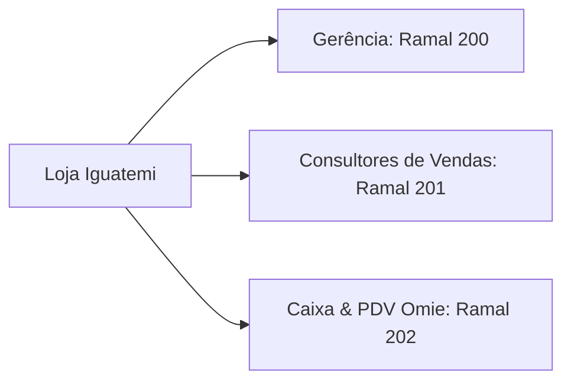

# GUI-002: Diretório Oficial de Contatos, Ramais e E-mails por Setor

> **Categoria**: Guias e FAQs 
> **Departamento**: Gestão Administrativa & Comunicação Interna 
> **Responsável**: Gestão Administrativa 
> **Tempo de Leitura**: 3 minutos 
> **Versão**: 1.0 (Yara Ltda. - Moda Sustentável)

---

## Objetivo
Centralizar a lista de contatos internos, ramais telefônicos, e-mails institucionais de cada departamento e canais de emergência da **Yara Ltda.** (Loja Shopping Iguatemi Brasília e Centro Operacional DF).

---

## Diretório por Departamento e Unidade

### 1. Diretoria Executiva

| Área / Cargo | Atribuição | Ramal Interno | E-mail Oficial |
| :--- | :--- | :--- | :--- |
| **Diretoria Financeira** | Gestão Financeira & Custos | Ramal 101 | `financeiro@yarastore.com.br` |
| **Diretoria de Produção** | Produção & Suprimentos | Ramal 102 | `producao@yarastore.com.br` |
| **Diretoria Administrativa & RH** | Gestão Administrativa, RH & Compliance | Ramal 103 | `rh@yarastore.com.br` |

---

### 2. Loja Conceito — Shopping Iguatemi Brasília (Lago Norte)

| Setor / Posto | Atribuição | Ramal | E-mail de Contato |
| :--- | :--- | :--- | :--- |
| **Gerência da Loja** | Coordenação geral do salão de vendas | Ramal 200 | `loja.iguatemi@yarastore.com.br` |
| **Salão de Vendas** | Atendimento presencial & consultores | Ramal 201 | `vendas.iguatemi@yarastore.com.br` |
| **Frente de Caixa (PDV)** | Pagamentos, NFC-e e embalagens | Ramal 202 | `caixa.iguatemi@yarastore.com.br` |
| **WhatsApp Oficial Loja** | Atendimento remoto a clientes | (61) 99123-4567 | `atendimento@yarastore.com.br` |

---

### 3. Centro Operacional & Logística (Brasília/DF)

| Setor | Atribuição | Ramal | E-mail de Contato |
| :--- | :--- | :--- | :--- |
| **Expedição & E-commerce** | Envio de pedidos nacionais e estoque | Ramal 301 | `logistica@yarastore.com.br` |
| **Logística Reversa & Trocas** | Postagens reversas (Melhor Envio) | Ramal 302 | `trocas@yarastore.com.br` |
| **Gestão Social & Doações** | Programa comunitário Estrutural/Ceilândia | Ramal 401 | `social@yarastore.com.br` |

---

## Parceiros Externos e Escalonamento de Emergência

| Entidade / Parceiro | Serviço | Contato Telefone / E-mail |
| :--- | :--- | :--- |
| **Ateliê Almada (DF)** | Fornecedor emergencial / Backup local | (61) 99888-7711 \| `contato@ateliealmada.com.br` |
| **Ecológica Têxtil (SC)** | Fornecedor de Ecobags e Embalagens | (48) 3622-1200 \| `atendimento@ecologicatextil.com.br` |
| **Suporte ERP Omie** | Sistema de Gestão & PDV SaaS | Chamado via Portal Omie \| `suporte@omie.com.br` |
| **Adm. Shopping Iguatemi DF** | Manutenção predial, ar e segurança | (61) 3577-5000 \| `sac.iguatemidf@iguatemi.com.br` |

---

## Instruções de Uso dos Ramais
- **Chamadas Internas**: Digite diretamente o número do ramal (ex: `101` para o Financeiro).
- **Transferência de Chamadas no Caixa**: Pressione `FLASH` + `RAMAL` no aparelho fixo do balcão.

---

## Resultado Esperado
Comunicação interna ágil e sem ruídos entre a loja do Shopping Iguatemi, o Centro Operacional e a diretoria, com tempo de resolução de dúvidas operacionais reduzido.
