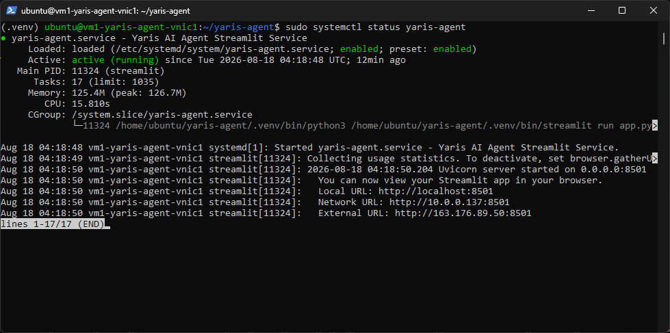
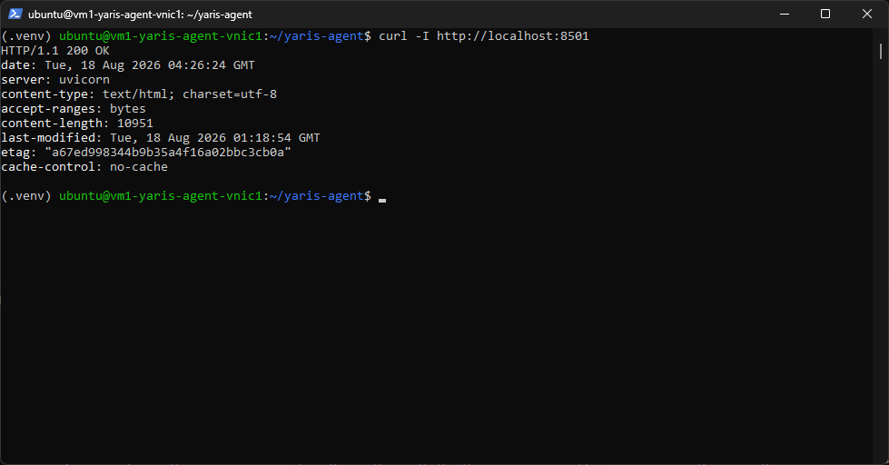
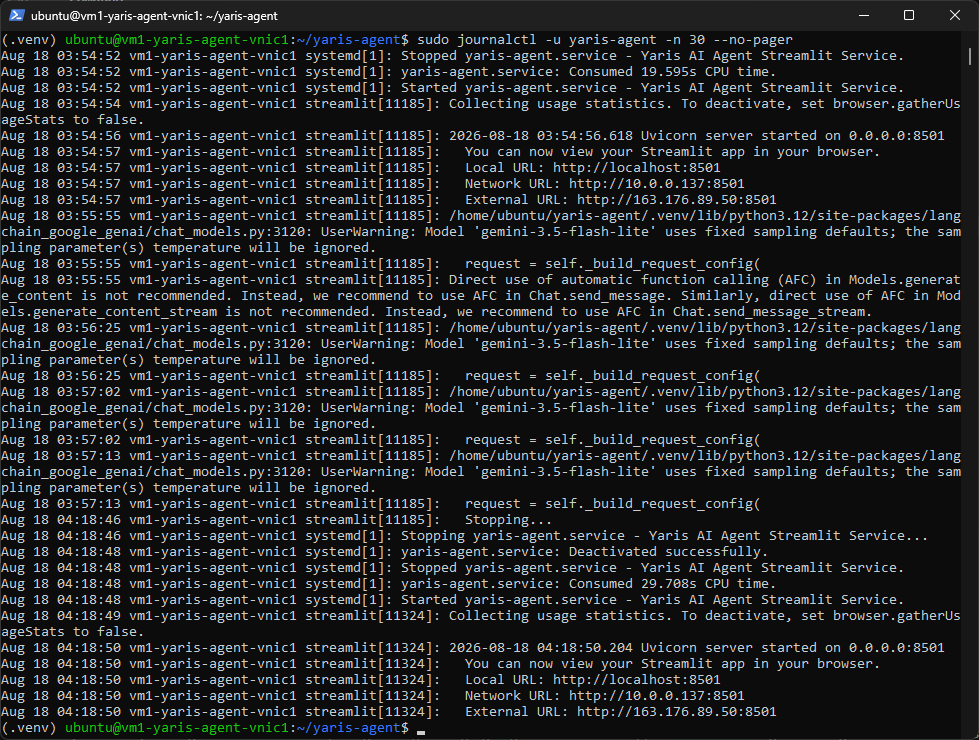
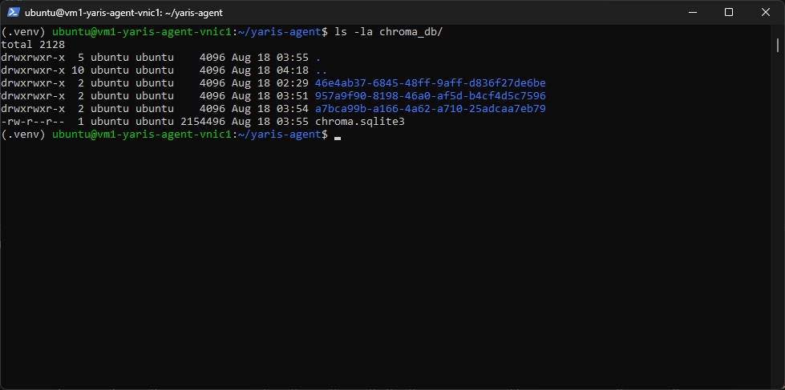
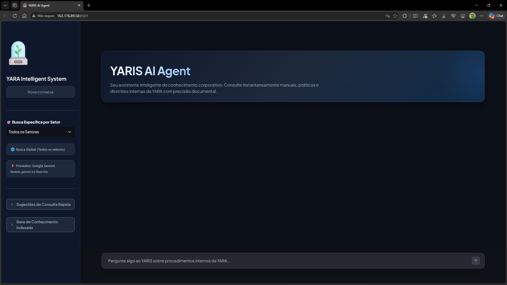

# Guia de Deploy & Evidências - YARIS AI Agent 

Este documento contém o passo a passo detalhado para o deploy da aplicação **YARIS AI Agent** diretamente em uma máquina virtual (VM) Ubuntu Linux utilizando **Python Virtual Environment (`venv`)** e gerenciamento de serviço via **`systemd`**, além dos procedimentos de coleta de evidências.

---

## 📌 1. Visão Geral da Arquitetura de Deploy

A aplicação é implantada diretamente no sistema operacional da VM Ubuntu:
- **Interface & Orquestrador:** Streamlit (Porta `8501`) + LangChain / LangGraph.
- **Ambiente Virtual Python:** Isolado em `~/yaris-agent/.venv`.
- **Gerenciamento de Processo:** Serviço Linux `systemd` (`yaris-agent.service`) para execução contínua 24/7.
- **Banco Vetorial:** ChromaDB persistido na pasta `./chroma_db`.
- **Provedor de LLM/Embeddings:** Google Gemini AI Studio (configurado via `.env`).

```
 +----------------------------------------------------------------+
 |                         Ubuntu VM                              |
 |                                                                |
 |  +----------------------------------------------------------+  |
 |  |            Ambiente Virtual Python (.venv)               |  |
 |  |  - Python 3.12                                           |  |
 |  |  - Streamlit App: app.py                                 |  |
 |  |  - Ingestão: pipeline_ingestao.py                        |  |
 |  +----------------------------------------------------------+  |
 |        ^                                                       |
 |        | (Controlado por Systemd: yaris-agent.service)         |
 |        v                                                       |
 |  [ ./chroma_db ]                                               |
 |                                                                |
 +----------------------------------------------------------------+
        | (Porta 8501)
        v
 [ Usuários / Internet ]
```

---

## 🚀 2. Pré-requisitos na VM Ubuntu

No terminal SSH da VM (`ubuntu@vm1-yaris-agent-vnic1`), certifique-se de que os pacotes básicos estão instalados:

```bash
sudo apt update
sudo apt install python3-pip python3-venv git -y
```

---

## 🛠️ 3. Passo a Passo do Deploy Nativo

### Passo 3.1: Obter o Código
```bash
cd ~/yaris-agent
git pull
```

### Passo 3.2: Criar e Ativar o Ambiente Virtual
```bash
python3 -m venv .venv
source .venv/bin/activate
pip install --upgrade pip
pip install -r requirements.txt
```

### Passo 3.3: Configurar o Arquivo de Ambiente (`.env`)
Crie ou edite o arquivo `.env` na raiz do projeto:

```bash
nano .env
```

Conteúdo recomendado:
```env
GOOGLE_API_KEY=sua_chave_api_aqui
EMBEDDING_PROVIDER=google
EMBEDDING_MODEL=models/gemini-embedding-001
LLM_PROVIDER=google
LLM_MODEL=gemini-2.5-flash
```

### Passo 3.4: Executar a Ingestão de Dados no ChromaDB
```bash
python pipeline_ingestao.py
```

---

## ⚙️ 4. Configurar Execução 24/7 com Systemd

Para que a aplicação rode continuamente e inicie automaticamente caso o servidor seja reiniciado:

### 1. Criar o arquivo de serviço:
```bash
sudo nano /etc/systemd/system/yaris-agent.service
```

### 2. Cole o conteúdo abaixo:
```ini
[Unit]
Description=Yaris AI Agent Streamlit Service
After=network.target

[Service]
User=ubuntu
WorkingDirectory=/home/ubuntu/yaris-agent
ExecStart=/home/ubuntu/yaris-agent/.venv/bin/streamlit run app.py --server.port 8501 --server.address 0.0.0.0
Restart=always
RestartSec=5

[Install]
WantedBy=multi-user.target
```

### 3. Ativar e iniciar o serviço:
```bash
sudo systemctl daemon-reload
sudo systemctl enable yaris-agent
sudo systemctl start yaris-agent
sudo systemctl status yaris-agent
```

---

## 🔍 5. Checklist de Validação & Evidências de Deploy

Execute e capture a saída dos seguintes comandos para compor o relatório de evidências:

### Evidência 1: Status do Serviço Systemd
**Comando:**
```bash
sudo systemctl status yaris-agent
```
**Saída Esperada:** `active (running)`.



---

### Evidência 2: Processo em Execução & Porta 8501
**Comando:**
```bash
curl -I http://localhost:8501
```
**Saída Esperada:** `HTTP/1.1 200 OK`.



---

### Evidência 3: Logs do Serviço em Tempo Real
**Comando:**
```bash
sudo journalctl -u yaris-agent -n 30 --no-pager
```



---

### Evidência 4: Verificação dos Dados Persistidos (ChromaDB)
**Comando:**
```bash
ls -la chroma_db/
```



---

### Evidência 5: Interface Web do YARIS AI Agent no OCI (Navegador)
**Endereço:** `http://163.176.89.50:8501`



---

## 🛡️ 6. Liberação de Firewall (Porta 8501)

1. **Firewall local (UFW):**
   ```bash
   sudo ufw allow 8501/tcp
   ```
2. **Oracle Cloud Security Rules:**
   - Adicionar regra de entrada (**Ingress Rule**):
     - **Protocolo:** TCP
     - **Porta:** 8501
     - **Origem:** 0.0.0.0/0
