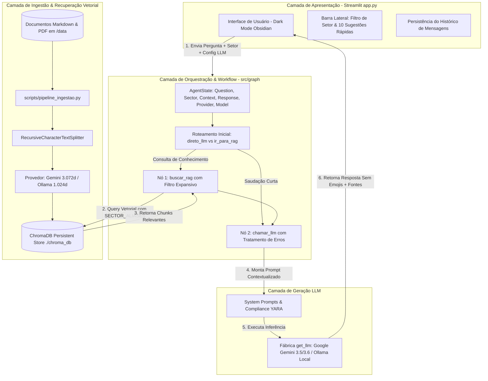

# 📖 Documentação Técnica Completa: YARIS Intelligent System

> **Projeto**: YARIS — Agente Corporativo de IA & Base de Conhecimento Interna (Yara Ltda.)  
> **Programa**: Desafio Final Alura Agent (Oracle + Alura ONE)  
> **Versão da Arquitetura**: 2.5 (LangGraph + ChromaDB + Ollama/Gemini 3.5/3.6 Flash)  
> **Autor(a)**: Jhiovana Silva ([`jhsribeiro`](https://github.com/jhsribeiro))  
> **Deploy de Produção**: Oracle Cloud Infrastructure (OCI) — `http://163.176.89.50:8501`

---

## 📋 Sumário Executivo e Técnico

1. [Arquitetura Geral do Sistema](#1-arquitetura-geral-do-sistema)
2. [Fluxo RAG e Grafos de Estado (LangGraph)](#2-fluxo-rag-e-grafos-de-estado-langgraph)
3. [Pipeline de Ingestão e Vetorização de Dados](#3-pipeline-de-ingestão-e-vetorização-de-dados)
4. [Banco Vetorial e Provedores de Embeddings](#4-banco-vetorial-e-provedores-de-embeddings)
5. [Engenharia de Prompt & Diretrizes Corporativas](#5-engenharia-de-prompt--diretrizes-corporativas)
6. [Interface Web & Componentes Frontend (Streamlit)](#6-interface-web--componentes-frontend-streamlit)
7. [Deploy & Infraestrutura em Nuvem (Oracle Cloud - OCI)](#7-deploy--infraestrutura-em-nuvem-oracle-cloud---oci)
8. [Suíte de Testes Automatizados (Pytest)](#8-suíte-de-testes-automatizados-pytest)
9. [Guia de Manutenção e Resolução de Problemas](#9-guia-de-manutenção-e-resolução-de-problemas)

---

## 1. Arquitetura Geral do Sistema

O **YARIS** (*Yara Intelligent System*) é uma solução de **Retrieval-Augmented Generation (RAG)** de nível corporativo projetada para responder a consultas sobre procedimentos internos, políticas de compliance, LGPD, operações fiscais, diretrizes trabalhistas, facilities, suprimentos e logística da **Yara Ltda.**

### 🏛️ Diagrama de Componentes da Arquitetura



### 🏢 Mapeamento dos 11 Setores Corporativos Indexados

A base do YARIS é dividida e categorizada em **11 setores corporativos**, permitindo filtragem precisa na busca vetorial:

1. **Jurídico & Contratos** (Análise de contratos, minutas, NDAs)
2. **Compliance & LGPD** (Proteção de dados, lei anticorrupção, termos)
3. **Recursos Humanos** (Onboarding, CLT, benefícios, banco de horas, contatos)
4. **Financeiro** (Operação de caixa Omie, emissão de NF, contas)
5. **Atendimento ao Cliente (SAC)** (SAC, ouvidoria, prazos de atendimento)
6. **TI & Chamados** (Portal de chamados, SLAs, reset de senha, infraestrutura)
7. **Comercial & Vendas** (FAQ vendas, alçadas de desconto, comissões)
8. **Facilities & Suprimentos** (Papelaria ecológica, insumos de escritório)
9. **Loja Conceito** (Venda presencial Iguatemi Brasília, sacolas biodegradáveis)
10. **Operações & Logística** (Logística reversa, contingência Ateliê Almada, rastreio Florent)
11. **Políticas Internas** (Moda sustentável/responsável, gestão social, reembolso)

---

## 2. Fluxo RAG e Grafos de Estado (LangGraph)

O motor do YARIS utiliza o **LangGraph** para garantir execução determinística, roteamento condicional de saudações e controle granular sobre a recuperação vetorial e geração.

### 2.1. Estrutura do Estado ([`src/graph/state.py`](file:///c:/Users/jhiov/dev/yaris-agent/src/graph/state.py))

O estado compartilhado no grafo de execução é definido pela classe `TypedDict` `AgentState`:

```python
from typing import TypedDict, List, Optional
from langchain_core.documents import Document

class AgentState(TypedDict, total=False):
    question: str                   # Pergunta original enviada pelo colaborador
    context: List[Document]         # Chunks de documentos recuperados do ChromaDB
    response: str                   # Resposta final gerada pela LLM
    sector: Optional[str]           # Filtro semântico de setor (ex: "Recursos Humanos")
    llm_provider: Optional[str]     # Provedor de LLM ("google" ou "ollama")
    llm_model: Optional[str]        # Nome do modelo (ex: "gemini-3.5-flash-lite", "llama3:8b")
```

### 2.2. Roteamento Inicial Condicional ([`src/graph/edges.py`](file:///c:/Users/jhiov/dev/yaris-agent/src/graph/edges.py))

Para otimizar o tempo de resposta e economizar requisições vetoriais, perguntas que consistem em saudações curtas ("oi", "olá", "bom dia") ignoram a busca no banco vetorial e vão direto para a geração da LLM:

```python
def roteamento_inicial(state: AgentState) -> str:
    question = state["question"].strip().lower()
    saudacoes = ["oi", "olá", "ola", "bom dia", "boa tarde", "boa noite", "tudo bem", "tudo bem?"]
    
    if question in saudacoes:
        return "direto_llm"
    return "ir_para_rag"
```

### 2.3. Nós de Execução ([`src/graph/nodes.py`](file:///c:/Users/jhiov/dev/yaris-agent/src/graph/nodes.py))

1. **`buscar_rag(state: AgentState)`**:
   - Lê `question` e `sector` do estado.
   - Instancia o retriever através da função `get_retriever(k=4, sector=sector)`.
   - Executa a busca por similaridade de cosseno no ChromaDB aplicando o filtro semântico expansivo por setor.
   - Atualiza o campo `context` no estado com a lista de objetos `Document`.

2. **`chamar_llm(state: AgentState)`**:
   - Valida a presença de documentos em `context`.
   - Se houver contexto, formata o `SYSTEM_PROMPT` injetando o texto dos chunks e a pergunta.
   - Se o contexto for vazio, injeta o `EMPTY_CONTEXT_PROMPT`.
   - Obtém a LLM dinamicamente via fábrica `get_llm(provider, model)`, suportando **Google Gemini** (`ChatGoogleGenerativeAI`) ou **Ollama Local** (`ChatOllama`).
   - Aplica tratamento resiliente de exceção para:
     - Erros de limite de cota (Erro 429 / `RESOURCE_EXHAUSTED`).
     - Erros de modelo não encontrado (Erro 404).
     - Erros de conexão com o serviço local do Ollama (Porta `11434`).

### 2.4. Grafo de Execução ([`src/graph/build.py`](file:///c:/Users/jhiov/dev/yaris-agent/src/graph/build.py))

```python
from langgraph.graph import StateGraph, END
from src.graph.state import AgentState
from src.graph.nodes import buscar_rag, chamar_llm
from src.graph.edges import roteamento_inicial

def construir_grafo():
    workflow = StateGraph(AgentState)
    
    workflow.add_node("buscar_rag", buscar_rag)
    workflow.add_node("chamar_llm", chamar_llm)
    
    workflow.set_conditional_entry_point(
        roteamento_inicial,
        {
            "ir_para_rag": "buscar_rag",
            "direto_llm": "chamar_llm"
        }
    )
    
    workflow.add_edge("buscar_rag", "chamar_llm")
    workflow.add_edge("chamar_llm", END)
    
    return workflow.compile()

app_graph = construir_grafo()
```

### 2.5. Visualização Automática do Grafo ([`scripts/visualizar_grafo.py`](file:///c:/Users/jhiov/dev/yaris-agent/scripts/visualizar_grafo.py))

O script [`scripts/visualizar_grafo.py`](file:///c:/Users/jhiov/dev/yaris-agent/scripts/visualizar_grafo.py) exporta o diagrama visual do fluxo para `docs/assets/fluxo_langgraph.png`.

---

## 3. Pipeline de Ingestão e Vetorização de Dados

O script [`scripts/pipeline_ingestao.py`](file:///c:/Users/jhiov/dev/yaris-agent/scripts/pipeline_ingestao.py) é responsável pela extração, divisão em chunks, marcação de metadados de setor e persistência no ChromaDB.

### 3.1. Classificação Dinâmica dos 11 Setores

A função `get_sector_from_filename` analisa o nome e prefixo dos arquivos na pasta [`data/`](file:///c:/Users/jhiov/dev/yaris-agent/data) para associar cada documento ao seu setor corporativo:

```python
def get_sector_from_filename(filename: str) -> str:
    fn = os.path.basename(filename).lower()
    
    if any(k in fn for k in ["pol-006", "16_juridico", "contrat", "juridico"]):
        return "Jurídico & Contratos"
    elif any(k in fn for k in ["pol-004", "compliance", "lgpd", "anticorrupcao", "1_politica_de_privacidade", "5_termos"]):
        return "Compliance & LGPD"
    elif any(k in fn for k in ["pol-003", "pol-005", "gui-001", "gui-002", "11_contatos", "6_manual_de_rh", "onboarding", "banco_de_horas"]):
        return "Recursos Humanos"
    elif any(k in fn for k in ["sop-002", "13_financeiro", "caixa_e_emissao_nf"]):
        return "Financeiro"
    elif any(k in fn for k in ["gui-003", "14_atendimento", "sac_"]):
        return "Atendimento ao Cliente (SAC)"
    elif any(k in fn for k in ["faq-002", "faq-003", "12_ti_chamados", "sistemas"]):
        return "TI & Chamados"
    elif any(k in fn for k in ["pol-007", "faq-001", "15_comercial", "comissoes"]):
        return "Comercial & Vendas"
    elif any(k in fn for k in ["sop-005", "facilities", "papelaria"]):
        return "Facilities & Suprimentos"
    elif any(k in fn for k in ["sop-001", "sop-007", "venda_presencial", "loja_conceito", "sacolas"]):
        return "Loja Conceito"
    elif any(k in fn for k in ["sop-003", "sop-004", "sop-006", "logistica", "estoque", "florent", "rastreamento", "inbound"]):
        return "Operações & Logística"
    elif any(k in fn for k in ["pol-001", "pol-002", "pol-008", "10_politica_interna"]):
        return "Políticas Internas"
    else:
        return "Políticas Internas"
```

### 3.2. Suporte a Múltiplos Formatos & Limpeza Automática

O pipeline carrega tanto arquivos **Markdown (`.md`)** quanto **PDFs (`.pdf`)** e reseta a coleção anterior no ChromaDB (`vectorstore.delete_collection()`) para prevenir duplicatas antes de reindexar:

```python
loader_md = DirectoryLoader(ddir, glob="**/*.md", loader_cls=TextLoader, loader_kwargs={"encoding": "utf-8"})
loader_pdf = DirectoryLoader(ddir, glob="**/*.pdf", loader_cls=PyPDFLoader)
```

### 3.3. Fragmentação de Texto (Text Chunking)

```python
text_splitter = RecursiveCharacterTextSplitter(
    chunk_size=1000,
    chunk_overlap=150
)
chunks = text_splitter.split_documents(documentos)
```

### 3.4. Loteamento e Retentativa Resiliente de Cota (Erro 429)

Para lidar com limites de cota da API (100 requisições/minuto), a inserção ocorre em lotes de 20 chunks com pausa de 61 segundos em caso de estouro:

```python
batch_size = 20
for i in tqdm(range(0, len(chunks), batch_size)):
    batch = chunks[i:i + batch_size]
    while True:
        try:
            vectorstore.add_documents(batch)
            break
        except Exception as e:
            err_str = str(e)
            if "429" in err_str or "RESOURCE_EXHAUSTED" in err_str or "quota" in err_str.lower():
                print("\nAVISO: Limite de cota atingido (Erro 429). Aguardando 61 segundos para reiniciar...")
                time.sleep(61)
            else:
                raise e
```

---

## 4. Banco Vetorial e Provedores de Embeddings

O módulo [`src/database/connection.py`](file:///c:/Users/jhiov/dev/yaris-agent/src/database/connection.py) gerencia a conexão com o **ChromaDB** e a comutação flexível de embeddings.

### 4.1. Provedores Suportados

| Provedor | Modelo | Dimensão Vetorial | Vantagem Principal |
| :--- | :--- | :--- | :--- |
| **Google Gemini (Padrão)** | `models/gemini-embedding-001` | **3.072** | Modelo nativo em nuvem de alta precisão semântica. |
| **Ollama Local** | `snowflake-arctic-embed2:latest` | **1.024** | 100% Offline, sem custos de API ou limites de cota. |

### 4.2. Recuperação Vetorial Filtrada & Aliases Expansivos (`SECTOR_ALIASES`)

Para evitar perdas de contexto quando dúvidas envolvem múltiplos departamentos interligados (ex: TI e Facilities, ou RH e Compliance), o `get_retriever` aplica um filtro expansivo `$in` usando mapeamento de aliases:

```python
SECTOR_ALIASES = {
    "Jurídico & Contratos": ["Jurídico & Contratos", "Compliance & LGPD", "Políticas Internas"],
    "Compliance & LGPD": ["Compliance & LGPD", "Jurídico & Contratos", "Políticas Internas"],
    "Recursos Humanos": ["Recursos Humanos", "Políticas Internas"],
    "Financeiro": ["Financeiro", "Políticas Internas"],
    "TI & Chamados": ["TI & Chamados", "Facilities & Suprimentos", "Loja Conceito"],
    "Atendimento ao Cliente (SAC)": ["Atendimento ao Cliente (SAC)", "Loja Conceito", "Operações & Logística"],
    "Comercial & Vendas": ["Comercial & Vendas", "Loja Conceito", "Políticas Internas"],
    "Facilities & Suprimentos": ["Facilities & Suprimentos", "Loja Conceito", "Operações & Logística", "TI & Chamados"],
    "Loja Conceito": ["Loja Conceito", "Facilities & Suprimentos", "Atendimento ao Cliente (SAC)", "TI & Chamados", "Comercial & Vendas"],
    "Operações & Logística": ["Operações & Logística", "Facilities & Suprimentos", "Atendimento ao Cliente (SAC)"],
    "Políticas Internas": ["Políticas Internas", "Compliance & LGPD", "Recursos Humanos", "Jurídico & Contratos", "Financeiro"]
}

def get_retriever(k=4, sector=None):
    vectorstore = get_vectorstore()
    search_kwargs = {"k": k}
    if sector and sector != "Todos os Setores":
        allowed_sectors = SECTOR_ALIASES.get(sector, [sector])
        search_kwargs["filter"] = {"sector": {"$in": allowed_sectors}}
    return vectorstore.as_retriever(search_kwargs=search_kwargs)
```

---

## 5. Engenharia de Prompt & Diretrizes Corporativas

O arquivo [`src/graph/prompts.py`](file:///c:/Users/jhiov/dev/yaris-agent/src/graph/prompts.py) define as diretrizes inegociáveis de comunicação da Yara Ltda.

### 5.1. Regras de Negócio Inegociáveis

1. **Regra do Termo Corporativo**:
   - Ao se referir às ações ou diretrizes da Yara Ltda., é **estritamente proibido utilizar a palavra "sustentabilidade"**.
   - Deve-se utilizar exclusivamente o termo **"responsabilidade ambiental e social"**.
   - O uso da palavra "sustentabilidade" só é permitido ao citar concorrentes ou o mercado geral.

2. **Identidade Estrita do Agente**:
   - O assistente deve se identificar sempre como **"YARIS, agente de IA interno da Yara"** (ou copiloto interno na YARA).

3. **Tom Corporativo Formal sem Emojis**:
   - NUNCA utilizar nenhum tipo de emoji, emoticon ou símbolo decorativo nas respostas.
   - Formatação limpa em Markdown com tabelas, títulos e listas enumeradas ou com hífens.

---

## 6. Interface Web & Componentes Frontend (Streamlit)

O arquivo [`app.py`](file:///c:/Users/jhiov/dev/yaris-agent/app.py) implementa a interface do usuário em **Streamlit** no estilo **Dark Mode Obsidian Premium** com tipografia `Plus Jakarta Sans`.

### 6.1. Funcionalidades da Interface

- **Hero Banner Principal**: Cabeçalho visual em gradiente com resumo do agente.
- **Barra Lateral Integrada**:
  - Exibição da logo oficial do YARIS ([`assets/logo_yaris.png`](file:///c:/Users/jhiov/dev/yaris-agent/assets/logo_yaris.png)).
  - Botão de **"Nova conversa"** para reset imediato da sessão.
  - Menu suspenso **Busca Específica por Setor** (11 Setores + Busca Global).
  - Indicador em tempo real do **Provedor e Modelo de IA** ativo.
  - Painel expansível com **10 Sugestões de Consulta Rápida** por setor.
  - Painel expansível da **Base de Conhecimento Indexada**.
- **Área de Chat e Rastreabilidade**:
  - Manutenção do histórico de conversação em `st.session_state.messages`.
  - Expander de transparência documental: **"Documentos Internos Consultados (Fontes RAG)"** exibindo o caminho do arquivo e o trecho exato utilizado.

---

## 7. Deploy & Infraestrutura em Nuvem (Oracle Cloud - OCI)

A aplicação **YARIS AI Agent** foi implantada e está operacional na nuvem da **Oracle Cloud Infrastructure (OCI)**.

### 7.1. Arquitetura de Hospedagem Nativa (Linux / systemd)

- **Servidor:** VM Compute OCI (Ubuntu Linux).
- **URL Pública:** `http://163.176.89.50:8501`
- **Porta do Streamlit:** `8501` (com regra de Ingress liberada no OCI Security List e no UFW).
- **Gerenciador de Processos:** Serviço `systemd` (`yaris-agent.service`) para execução contínua 24/7 com restart automático.

### 7.2. Configuração do Serviço Systemd (`/etc/systemd/system/yaris-agent.service`)

```ini
[Unit]
Description=Yaris AI Agent Streamlit Service
After=network.target

[Service]
User=ubuntu
WorkingDirectory=/home/ubuntu/yaris-agent
ExecStart=/home/ubuntu/yaris-agent/.venv/bin/streamlit run app.py --server.port 8501 --server.address 0.0.0.0
Restart=always
RestartSec=5

[Install]
WantedBy=multi-user.target
```

---

## 8. Suíte de Testes Automatizados (Pytest)

O repositório conta com uma suíte completa de testes automatizados com **Pytest** na pasta `tests/`.

### 8.1. Estrutura dos Testes

| Arquivo de Teste | Componente Testado | Descrição dos Casos de Teste |
| :--- | :--- | :--- |
| [`tests/test_sector_classification.py`](file:///c:/Users/jhiov/dev/yaris-agent/tests/test_sector_classification.py) | Ingestão (`scripts/pipeline_ingestao.py`) | Valida se arquivos das categorias SOP, POL, GUI e FAQ são classificados nos 11 setores corretos. |
| [`tests/test_graph_edges.py`](file:///c:/Users/jhiov/dev/yaris-agent/tests/test_graph_edges.py) | Roteamento LangGraph (`src/graph/edges.py`) | Garante que saudações curtas acionam `"direto_llm"` e dúvidas corporativas direcionam para `"ir_para_rag"`. |
| [`tests/test_database_aliases.py`](file:///c:/Users/jhiov/dev/yaris-agent/tests/test_database_aliases.py) | Banco Vetorial (`src/database/connection.py`) | Valida a presença e consistência dos aliases semânticos cruzados no dicionário `SECTOR_ALIASES`. |
| [`tests/test_prompts_and_compliance.py`](file:///c:/Users/jhiov/dev/yaris-agent/tests/test_prompts_and_compliance.py) | Compliance (`src/graph/prompts.py`) | Verifica o cumprimento das diretrizes de não uso de emojis, substituição por "responsabilidade ambiental e social" e nome YARIS. |
| [`tests/test_nodes.py`](file:///c:/Users/jhiov/dev/yaris-agent/tests/test_nodes.py) | Nó de Execução (`src/graph/nodes.py`) | Testa a função auxiliar `_format_response_content` para strings, listas e dicionários. |
| [`tests/test_graph_build.py`](file:///c:/Users/jhiov/dev/yaris-agent/tests/test_graph_build.py) | Compilação do Grafo (`src/graph/build.py`) | Garante que o grafo do LangGraph compila corretamente com os nós e bordas requeridos. |

### 8.2. Executando a Suíte de Testes

Para rodar todos os 24 testes unitários e de integração:

```bash
pytest tests/
```

Saída esperada:
```
======================= 24 passed in 3.40s =======================
```

---

## 9. Guia de Manutenção e Resolução de Problemas

### 9.1. Solução de Erros Frequentes

#### 🔴 Erro: `InvalidArgumentError: Collection expecting embedding with dimension of 1024, got 3072`
- **Causa**: Os vetores persistidos no ChromaDB pertencem ao Ollama (1.024d), mas o modelo ativo configurado no `.env` é o Gemini (3.072d).
- **Solução**: Garanta a consistência entre a ingestão e a aplicação. Se regerou o ChromaDB com Gemini, mantenha `EMBEDDING_PROVIDER=google` no `.env`. Execute `python scripts/pipeline_ingestao.py` novamente.

#### 🔴 Erro: `429 RESOURCE_EXHAUSTED` (Google API Rate Limit)
- **Causa**: Limite da cota gratuita da API do Gemini atingido temporariamente.
- **Solução**: O nó `chamar_llm` em [`src/graph/nodes.py`](file:///c:/Users/jhiov/dev/yaris-agent/src/graph/nodes.py) trata o erro amigavelmente. Aguarde de 15 a 30 segundos e reenvie a pergunta.

#### 🔴 Erro: `404 NOT_FOUND` em Modelos Gemini
- **Causa**: Nome de modelo inexistente ou descontinuado no `.env` / `src/config.py`.
- **Solução**: Utilize modelos válidos como `gemini-3.5-flash-lite`, `gemini-3.6-flash` ou `gemini-2.5-flash`.

#### 🔴 Erro: Conexão Recusada no Ollama (Porta 11434)
- **Causa**: O serviço local do Ollama não está rodando na máquina.
- **Solução**: Inicie o Ollama (`ollama serve`), certifique-se de ter baixado o modelo (`ollama run llama3:8b`), ou altere `LLM_PROVIDER=google` no arquivo `.env`.

---

## 📄 Licença e Propriedade

Este projeto é de propriedade da **Yara Ltda.** e foi desenvolvido por **Jhiovana Silva** para o **Desafio Final Alura Agent (Oracle + Alura ONE)** sob licença MIT.
